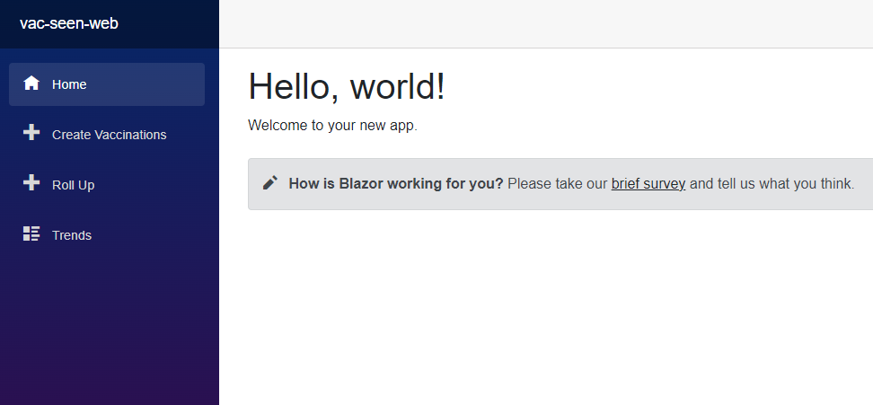

# vac-seen-web
## What is this?
This repo is Part One (of eight) of a workshop/activity/tutorial that comprises the "Vac-Seen System". This system is associated with, and specifically created for, the [Red Hat OpenShift Sandbox](https://developers.redhat.com/developer-sandbox).

At the end of this tutorial you will have an instance of a small website that is running in an OpenShift cluster.

## Need help?
If you need help or get stuck, email devsandbox@redhat.com.
If you find a defect, [create an Issue](https://docs.github.com/en/issues/tracking-your-work-with-issues/creating-an-issue) in this repository.

## Prerequisites
The following **three** prerequisites are necessary:
1. An account in [OpenShift Sandbox](https://developers.redhat.com/developer-sandbox) (No problem; it's free). This is not actually *necessary*, since you can use this tutorial with any OpenShift cluster.
1. The `oc` command-line tool for OpenShift. There are instructions later in this article for the installation of `oc`.
1. Your machine will need access to a command line; Bash or PowerShell, either is fine.

## All Operating Systems Welcome
You can use this activity regardless of whether your PC runs Windows, Linux, or macOS.

## Part 0: Prepare the prerequisites
### 0.1 Get your sandbox
The [Developer Sandbox for Red Hat OpenShift](https://developers.redhat.com/developer-sandbox) is a free offering from Red Hat that gives you developer-level access rights to an OpenShift cluster. If you have not already signed up for this free cluster, do so by visiting [the Developer Sandbox web page](https://developers.redhat.com/developer-sandbox). It's free and requires only an email address and password; no credit card necessary.

### 0.2 Install the 'oc' CLI
The `oc` command line interface (CLI) allows you to work with your OpenShift cluster from a terminal command line. The `oc` CLI for OpenShift can be installed by following the instructions on [the oc CLI Getting Started web page](https://docs.openshift.com/container-platform/4.9/cli_reference/openshift_cli/getting-started-cli.html).

### 0.3 Log in to your sandbox from the command line
Open a terminal session on your local machine and use the `oc login` command to log into your cluster from there. The instructions for doing that are in [this short article](https://developers.redhat.com/blog/2021/04/21/access-your-developer-sandbox-for-red-hat-openshift-from-the-command-line).  This can be done using macOS, Windows, and Linux.

## Part 1: Create the application
This application image has been built and stored in an image registry. To run the appication in OpenShift, you will pull the image from the registry into OpenShift.

### Step 1.1
Create this application in OpenShift using this command:  
`oc new-app --name=vac-seen-web --image=quay.io/donschenck/vac-seen-web:latest`

```bash
oc new-app --name=vac-seen-web --image=quay.io/donschenck/vac-seen-web:latest
--> Found container image f0fb823 (4 days old) from quay.io for "quay.io/donschenck/vac-seen-web:latest"

    * An image stream tag will be created as "vac-seen-web:latest" that will track this image

--> Creating resources ...
    imagestream.image.openshift.io "vac-seen-web" created
    deployment.apps "vac-seen-web" created
    service "vac-seen-web" created
--> Success
    Application is not exposed. You can expose services to the outside world by executing one or more of the commands below:
     'oc expose service/vac-seen-web'
    Run 'oc status' to view your app.
```

## Part 2: Creating a route to the application
### Step 2.1
Make this application reachable outside of OpenShift using this command:  
`oc expose service/vac-seen-web`
```bash
oc expose service/vac-seen-web
route.route.openshift.io/vac-seen-web exposed
```


## Part 3: Proving the installation
### Step 3.1
Run this command to get the route:  
`oc get routes`  

```bash
oc get routes
NAME               HOST/PORT                                                                              PATH   SERVICES           PORT       TERMINATION     WILDCARD
vac-seen-web       vac-seen-web-rhn-engineering-dschenck-dev.apps.sandbox.x8i5.p1.openshiftapps.com              vac-seen-web       8080-tcp                   None
```

### Step 3.2
Use the URL from the previous step to open the page in a web browser.  




## Congratulations
You have the vac-seen-web application running in OpenShift.
